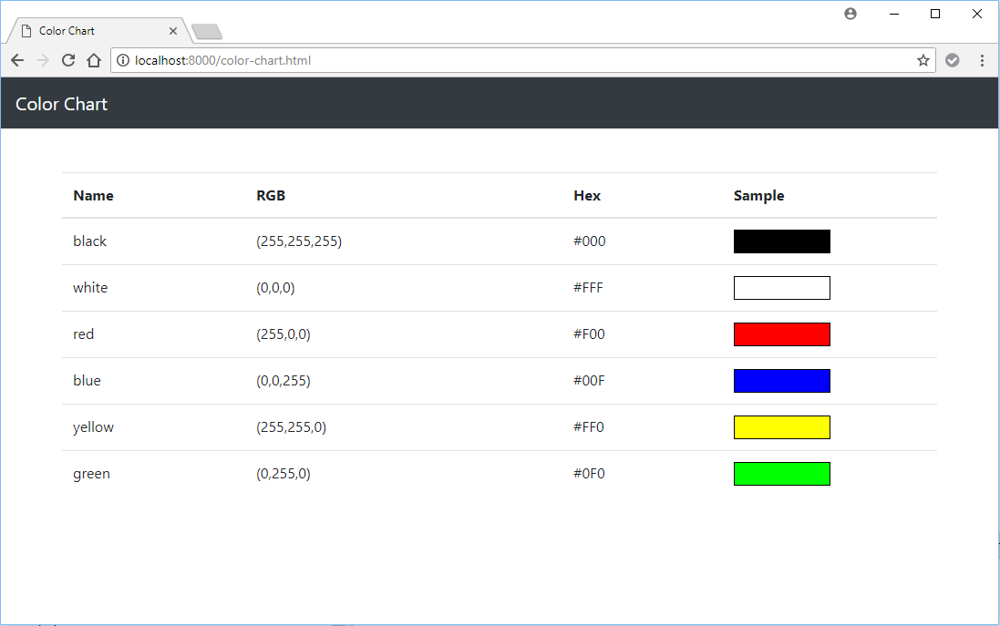

## Color Chart (2018-06-07)

Goal: render the following chart from the contents of [colors.json](color-chart/colors.json):

I have created a [template](color-chart/color-chart.html) for you. All of your work should go in the empty `<script>` element at the bottom of the page.

### Links:

* [$.getJSON()](http://api.jquery.com/jquery.getjson/)
* [$.each()](http://api.jquery.com/each/)
* [$.append()](http://api.jquery.com/append/)